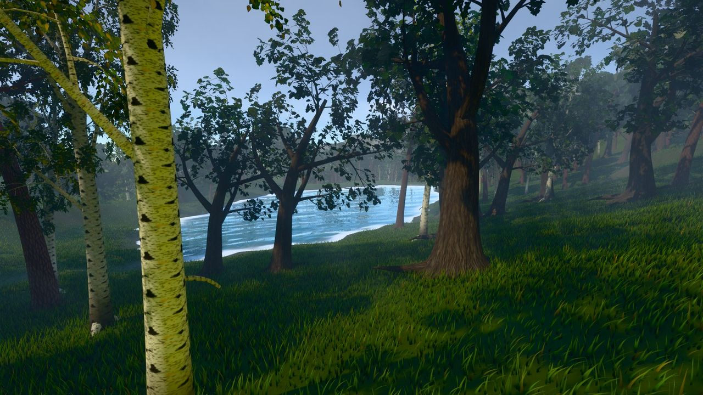
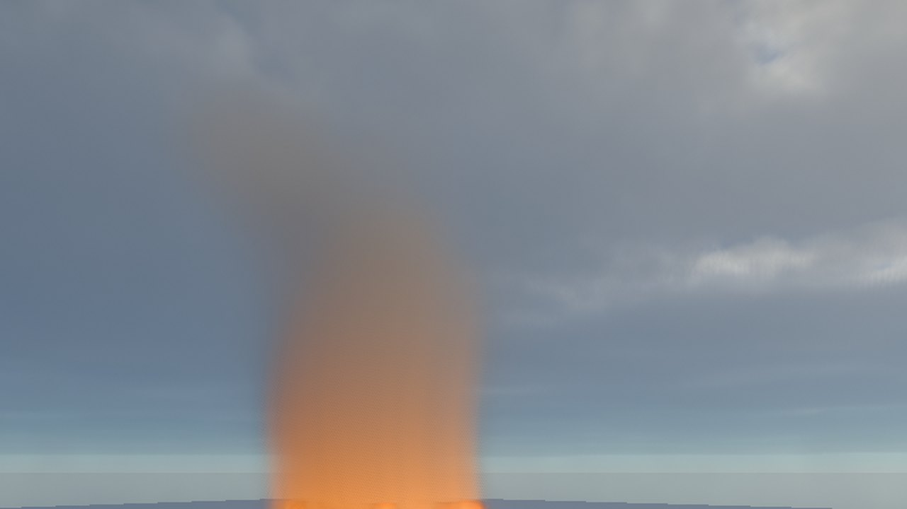
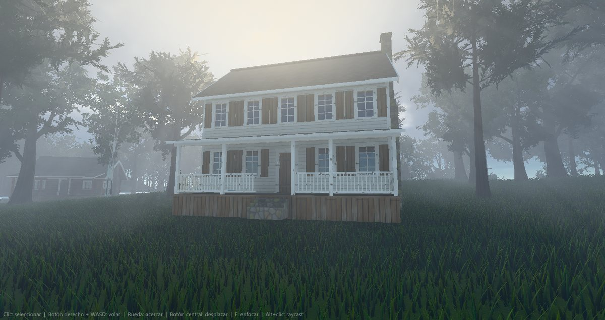
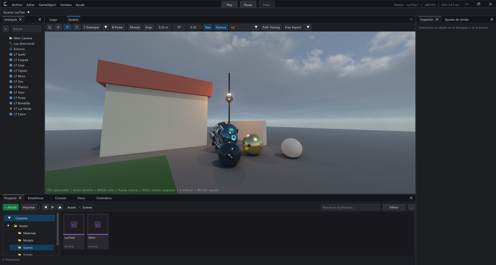
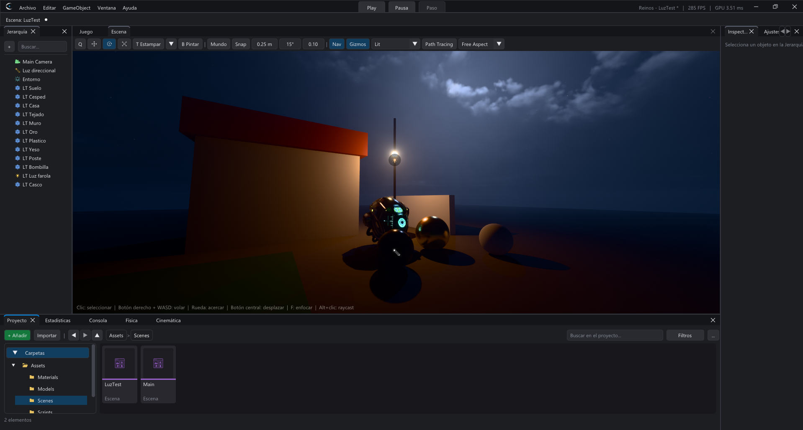

# Cramion


Motor de render en tiempo real para Windows con **renderizador diferido en Vulkan 1.3** (y un modo compatible desde Vulkan 1.0 para Android y GPU antiguas) e iluminación física: PBR metal/rugosidad, cielo atmosférico, IBL, sombras en cascada, oclusión ambiental e iluminación global en espacio de pantalla, con post-proceso HDR (bloom, auto-exposición por histograma, rayos de luz, tonemapping).

El motor son dos librerías estáticas propias: **CramionFX**, el renderizador Vulkan con todos sus shaders, y **CramionDM**, la capa de plataforma (ventana, entrada y dispositivo DirectX 12). `cramion.exe` es solo una aplicación de ejemplo que las usa. Todo se compila con **CMake + Clang + Ninja**.

**Licencia:** el editor es gratis y los juegos que hagas con él son tuyos: los vendes donde quieras, **sin regalías**. **El motor no se puede vender, revender ni resubir.** El **código fuente** solo se entrega con una licencia de código fuente: pídela por correo a **tupapienrakion1234@gmail.com**. La única descarga oficial es la de la web, <https://cramion.mantraxtools.store>; si ves a alguien vendiéndolo, avisa en el Discord. Detalles en [LICENSE](LICENSE).

**Comunidad:** dudas, ideas y lo que estés creando con Cramion, en el [Discord](https://discord.gg/zG7rSsUGEz).

**Apoya Cramion:** el motor es gratis; si te sirve, puedes donar en [PayPal](https://paypal.me/evan2025).

Incluye dos escenas de demostración, iluminadas por una sola luz direccional (el sol de día, la luna de noche) y su cielo:
- **Catedral de Šibenik** (por defecto): 75 mil triángulos. Un interior en el que el sol entra por los ventanales.
- **San Miguel**: ≈10 millones de triángulos, 287 materiales y 266 texturas. Un patio exterior.

**Descarga:** el zip listo para usar (editor, player y documentación) está en <https://cramion.mantraxtools.store>. La lista completa de cambios de cada versión, en [CHANGELOG.md](CHANGELOG.md).

---

## Novedades de la 2.3

**Android en casi todos los móviles**: el render tiene un **modo compatible** que funciona con la GPU de cualquier móvil con Vulkan 1.0 o superior (Adreno, Mali, PowerVR, Xclipse); antes pedía Vulkan 1.3 y en muchos no arrancaba. El APK lleva también la librería de **32 bits** (Android Go y gama baja), pide **Android 8.0** y las **texturas DDS** funcionan en las GPU que no las leen (Mali, PowerVR). El juego se dibuja a la **resolución que el móvil puede mover** (720p en Baja, 900p en Media, 1080p en Alta; la pantalla la escala sin coste) con sombras y texturas a la medida del teléfono.

**PC de gama baja mucho más rápidos**: las sombras del sol ya no se redibujan si nada se mueve y en gama baja se intercalan las cascadas; la GI, el SSAO, los reflejos y los rayos de luz apagados ya no cuestan, y el cielo solo se rehace si cambia. En Bistro con el preset Bajo, de **5,24 a 1,66 ms** de GPU con la cámara quieta y las sombras de 2,25 a 0,63 ms con la cámara girando.

**Trazado de rayos sin hormigueo**: las sombras y los reflejos por rayos se filtran en el tiempo y en el espacio y sus rayos salen de la cara real del triángulo: con la imagen quieta, los píxeles que cambian de un frame a otro pasan del 0,61 % al 0,03 %.

**Realidad virtual como en Unity**: **Play on VR** sin reabrir el editor, una cámara por ojo a la resolución del casco, **coger y lanzar con las manos** (XR Interactor y XR Grabbable), **UI en el mundo**, el **Jugador VR** con física y la **plantilla de VR** con su script de C++.

**Arreglos**: una línea de rayas oscuras en el borde de abajo de la imagen y un cierre del editor al listar las plantillas si en Descargas había un archivo con un emoji en el nombre.

## Novedades de la 2.2

**Pies en el suelo, rehechos** (humanos y animales): los pies ya no flotan al andar ni de pie; en escaleras cada pie mira el suelo bajo el tobillo y la punta (no se mete en los escalones), el pie que va por el aire sube antes de llegar a la tabica y la cadera ya no pega un salto cuando el Character Controller sube o baja un escalón. Las rodillas siempre se doblan hacia delante (antes, con la pierna recta, podían doblarse hacia dentro, contra la otra pierna, o hacia atrás), las patas de los animales como en su pose de reposo y en el aire (saltar, caer) el IK se aparta solo.

**Rendimiento**: **Insights**, un perfilador de CPU con árbol de zonas, percentiles del frame, tirones que se capturan solos y capturas `.crtrace` para Perfetto (también en el juego exportado). Y presupuestos automáticos: **LOD de animación**, **presupuesto de partículas** y **voces de audio virtuales**.

**Audio que se para de verdad**: al dar Stop ya no siguen sonando la lluvia, el viento, los truenos ni la reverberación, y pausar el Play pausa el audio.

**Animación**: `crossFade` como el `Animator.CrossFade` de Unity, FBX solo de animación (sin malla) y retargeting de BVH y Motifect sin pies flotando.

## Novedades de la 2.1

La 2.1 incluye también todo lo de la 2.0 (más abajo), que no se publicó por separado.

**Grafos de nodos para todo**: **Shader Graph** (materiales con nodos y vista previa), **VFX Graph** (partículas simuladas enteras en la GPU, de cientos a cientos de miles), **Visual Scripting** como los Blueprints (toda la API como nodos, con depuración en vivo y puntos de ruptura), **Behavior Trees** con pizarra y **Diálogos** ramificados.

**Juego**: partidas guardadas, localización con plurales, repeticiones (killcam, cámara lenta), **Motion Matching**, **destrucción** con trozos de Voronoi y **vehículos** completos con asistente de ruedas.

**2D**: sprites y hojas de sprites, animación por fotogramas, **tilemaps con Rule Tiles**, luces 2D, física 2D propia y la plantilla *Plataformas 2D*.

**Iluminación horneada** en volúmenes de sondas: luz rebotada casi gratis en Android y en PCs sin trazado de rayos.

**Flujo de trabajo**: **Git** dentro del editor, **pruebas automáticas** (Test Runner y `--run-tests` para CI), **Steam** (logros, marcadores, nube, Workshop, salas) y recarga en caliente de C++ que **conserva el estado** sin parar Play.

## Novedades de la 2.0

**Scripts en C++**: el lenguaje del motor (Lua queda obsoleto). Clases con `start`, `update` y colisiones, **propiedades en el Inspector** como en Unity, compilador incluido (no hace falta Visual Studio), **IntelliSense de clangd** y scripts aislados en **otro proceso**: un puntero nulo o un bucle infinito no tumban el editor. Toda la API de Lua está también en C++.

**Luz mucho más realista**: los rayos ven ahora el **terreno y los árboles**, **sombras del sol por rayos**, oclusión del cielo sin RT, luces locales sin fugas, tonemapper **AgX** y **autoenfoque suave**. El RT apagado no cuesta nada y ya no da tirones al moverse algo.

**Árboles y hierba realistas**: copas que **se iluminan a contraluz**, cortezas nuevas de roble y pino, **pinos con brotes de agujas en 3D**, abetos densos y **hierba en matas** con manchas de color, puntas secas y paja.

**Streaming de modelos y animaciones**: se cargan en segundo plano, se suben a la GPU poco a poco y lo que no se ve sale de la memoria de vídeo; instanciar ya no da tirones.

**Modelado poligonal** como ProBuilder (vértices, aristas y caras, extruir, bisel, booleanas, Catmull-Clark...) y un **Character Controller** que sube escalones, respeta pendientes y sigue a las plataformas. Además, **CVars** como las de Unreal y ríos en cuesta que ya no se cortan.



## Novedades de la 1.9

**Ambiente y clima** (como Enviro Sky): clima con transiciones, hora y fecha con el sol y la luna reales, estaciones, viento, rayos con truenos, **lluvia y nieve que caen y se acumulan** y sonido ambiente.

**Fuego**: incendios que se propagan por la hierba y el bosque según el viento y la pendiente, con **llamas y humo volumétricos**, luces que parpadean y suelo carbonizado.

**Líquidos** en la GPU: agua, miel, lava, barro, sangre, aceite y ácido que chocan, salpican, **hacen flotar los objetos** y se ven como una superficie continua.

**Océano FFT** como Crest (olas calculadas con el viento, mar de fondo y espuma), ríos con corriente y una vista bajo el agua nueva.

**Máquinas de estados** para la IA, como los State Graphs de Bolt, en su propia pestaña del editor y en vivo durante el Play. Y un **editor renovado**: tema nuevo e Inspector con tarjetas, buscador y copiar/pegar valores.



## Novedades de la 1.8

**Mundo procedural**: *Ventana > Generador de terreno* crea en un segundo una isla, archipiélago, continente, cordillera o cañones con **erosión por lluvia**, **ríos** que bajan hasta el mar, **lagos**, océano y **8 capas** con texturas realistas. Encima, **hierba en la GPU** (millones de briznas con viento que se apartan con la física), **árboles procedurales** con ramas de verdad (pino, abeto, roble, abedul, palmera y sauce; nunca en el agua) y **aldeas**.

**Casas y cabañas procedurales** (*Ventana > Generador de casas*): cabaña de troncos, de tablas, casita de piedra y casa de campo, listas para el juego: pocos triángulos, 9 materiales PBR compartidos con relieve, colisión y una puerta que se abre girándola.

**Bajo el agua** en océanos, lagos y ríos, solo donde de verdad hay agua.



## Novedades de la 1.7

**Materiales de Disney** (Burley 2012/2015, el modelo de Unreal, Unity HDRP y el *Principled BSDF* de Blender): todos los materiales llevan el **difuso de Burley**, y cada uno elige un **modelo**: **Barniz** (clearcoat, con su propio reflejo), **Tela** (sheen), **Piel / cera** (subsurface y translucidez a contraluz según el grosor), **Anisótropo** (metal cepillado, con dirección) y **Transmisión** (vidrio con refracción por IOR, grosor, tinte y esmerilado). Tinte especular en todos. El path tracing usa el mismo modelo.

## Novedades de la 1.6

**Relieve teselado**: con un mapa de altura, el material puede elegir **Teselación** en vez de parallax. La malla se parte cerca de la cámara (un vértice cada ~10 píxeles, hasta la *Densidad* del material) y cada vértice sube lo que dice el mapa: silueta, sombras del sol y de las luces y oclusión reales, como el displacement de Unreal. Si la GPU no tesela, se usa el parallax.

**Auto-sombra del parallax**: las piedras y grietas del relieve se hacen sombra entre ellas con el sol (casilla *Auto-sombra*). Y los **shaders propios** (`.crshader`) con mapa de altura reciben el mismo parallax.

**Donaciones**: botón **Donar con PayPal** en el Hub y en la web (https://paypal.me/evan2025). Cramion sigue siendo gratis.

## Novedades de la 1.5

**Licencia nueva**: el editor sigue siendo gratis y lo que hagas con él es tuyo, para venderlo sin regalías. Lo que ya no se permite es **vender, revender o resubir el motor**, quitar los créditos o hacerlo pasar por otro. Vale también para la 1.4 y las anteriores desde el 30 de septiembre de 2026.

**Código fuente bajo licencia**: deja de ser público. Se entrega con una licencia de código fuente que se pide por correo a tupapienrakion1234@gmail.com.

**Créditos en orden**: el zip trae `LICENSE`, `TRADEMARK.md` (nombre y logo) y `THIRD_PARTY_NOTICES.md` con las licencias de todas las librerías.

## Novedades de la 1.4

**DataPacks, como los AssetBundles de Unity**: escenas enteras u objetos con todo lo que usan (modelos, materiales, texturas, scripts, sonidos...) en un solo archivo `.datapack`, sin el ejecutable, para niveles descargables, DLC, mods o skins. Se exportan desde *Archivo > Exportar escena como DataPack...* o con **clic derecho en un objeto > Empaquetar y exportar como DataPack**, en segundo plano con barra de progreso. El juego los carga en marcha con `DataPack.loadScene("Nivel2")` o `DataPack.instantiate("Skins", "Coche")`, sin tocar sus propios archivos.

**Sombras por rayos para muchas luces**: con trazado de rayos, farolas, antorchas y focos proyectan sombras trazadas (las 4 luces que más aportan a cada píxel), con **radio de la fuente** para penumbras reales. ~0,5 ms con 16 luces.

**Funciones de las GPUs actuales**: **mesh shaders** para las sombras del sol y la geometría (de 56 a 61 FPS en una escena grande), **opacity micromaps** para el follaje en el trazado de rayos y **Shader Execution Reordering** opcional en el path tracing.

**Editor**: elige si Play salta a la pestaña Juego o se queda en la vista actual, como en Unity; IntelliSense con `DataPack`, `Screen`, `XR` y lo que faltaba de `Input`.

**Corregido**: el plano lejano (*Far*) de la cámara no hacía nada, y lo que ilumina una farola se descoloraba de noche al apartar la vista.

## Novedades de la 1.3

 

**Noches realistas**: visión nocturna del ojo (efecto Purkinje): lo que solo ilumina la luna se vuelve gris azulado y lo que alumbra una farola conserva su color. Luna con mares y halo, estrellas de colores y la Vía Láctea. Se regula con *Visión nocturna* en el PostProcessing.

**Terminal con IA en el editor**: *Ventana > Terminal (IA)* abre consolas de Windows con pestañas y un botón que lanza **Claude Code ya conectado al editor** por MCP. También PowerShell, CMD, Codex y Gemini.

**Luces dentro de su lámpara**: una luz puesta dentro de la bombilla o del poste de una farola ya no queda tapada por ellos.

**Sombras más rápidas**: los personajes animados ya no obligan a redibujar todo el mapa de sombras del sol cada frame (de 39 a 58 FPS en una escena con mucha hierba), con caché de lo estático como Unreal.

**AMD FSR 3.1 y NVIDIA DLSS 4** *(inestables)*, y salida con la curva sRGB exacta.

## Novedades de la 1.2

**Realidad virtual (OpenXR)**: juega con cualquier casco de PC (SteamVR, Meta Quest Link, Windows Mixed Reality...) activando *Realidad virtual* en la configuración de compilación, o pruébalo en el editor con *Editar > Play en realidad virtual*. Rig *XR Origin* con cámara y mandos como en Unity, los mandos en Input Actions y la tabla `XR` en Lua (poses, gatillos, botones y vibración).

**Input Actions como el Enhanced Input de Unreal**: acciones Bool / float / Vec2 / Vec3 con muchas teclas cada una (teclado, ratón, mando, táctil y mandos de VR), varios contextos con prioridad, modificadores y triggers (Hold, Tap, Chord...). Se configuran en *Archivo > Entrada del proyecto* y se usan desde Lua con `Input.getAction` y `Input.bindAction`.

**Telas**: cortinas, banderas y sábanas que cuelgan, ondean con el viento y chocan con todo (soft bodies de Jolt), con sombras y motion blur.

**Cuerpos blandos**: gelatinas y pelotas de goma que caen, rebotan, se aplastan y vuelven a su forma.

**IntelliSense completo en el editor de scripts**: toda la API del motor, tipos que sigue por tus variables, lo de tu proyecto dentro de los textos (componentes, acciones, escenas, prefabs, sonidos...) y la firma de cada función. Y el editor ya no tiembla al escribir.

## Novedades de la 1.0

**Android**: exporta tu juego a **APK**, **AAB** (Google Play) y **OBB**, con paquete, versión, orientación, permisos, icono y firma configurables, sin Gradle ni Android Studio. *Exportar e instalar* lo abre en tu móvil o en el emulador. Funciona en GPUs de móvil de gama media (probado en Mali-G52) con un perfil móvil que apaga lo que no aguantan, y el arranque descomprime los assets en paralelo directamente desde el APK.

**Controles táctiles como en Unreal**: joystick, zona para mirar y botones que se diseñan una vez en *Archivo > Controles táctiles*, se prueban en el editor con el botón *Táctil* y se controlan desde Lua. Los scripts de teclado y ratón funcionan en el móvil sin cambios.

**Mando y orientación**: mandos Bluetooth/USB y `Screen.setOrientation` para girar la pantalla libremente o dejarla fija.

**Render**: preset *Ultra realista* y los ajustes gráficos se aplican al momento, sin reiniciar.

**Corregido**: el cierre con error del editor y del juego.

## Novedades de la 0.8.6

**Corregido**: la 0.8.5 se cerraba al abrir y al cerrar el editor (error en `nvoglv64.dll`). Si la 0.8.5 no te abre, descarga la 0.8.6 a mano.

## Novedades de la 0.8.5

**Luces en mapas grandes**: con más de 32 luces puntuales (u 8 focos) se dibujan las más cercanas a la cámara, no las primeras de la Jerarquía, y las luces apagadas ya no ocupan hueco. Se acabaron las salas del final a oscuras.

**Decals**: hasta 32 imágenes distintas por escena (antes 8).

## Novedades de la 0.8.0

**Agua realista**: las olas se tapan unas a otras (las de detrás ya no se ven delante), **borreguitos** de espuma en las crestas cuando hay oleaje y un mar lejano sin rayas.

**Sombras del sol con penumbra real**: nítidas al pie de los objetos y suaves cuanto más lejos está lo que las proyecta, como con el sol de verdad. Con el cielo cubierto la luz ambiente se vuelve gris, como en un día nublado.

**Nubes realistas**: claros y masas repartidos por el cielo, estratos, cúmulos y cumulonimbos, viento que las mueve y las inclina, y **sus sombras recorren el suelo**. Todo se ajusta en el componente Sky.

**Animación más realista**: transiciones **inerciales** como en Unreal (el cuerpo conserva su impulso al cambiar de animación, sin poses flotando), *continuar el ciclo* entre estados y **pies bloqueados** que no patinan.

**Path tracing** con un botón en la vista Escena, **fuerza de la sombra** en cada luz, **motion blur**, **profundidad de campo** con bokeh, distorsión y destellos de lente.

**Presets de post-procesado** (y de cualquier componente): Realista, Cinematográfico, Noche, Terror, Retro... o los tuyos guardados en el proyecto.

**Crear materiales y asignarlos**: clic derecho en uno o varios modelos y cada malla sale con sus texturas.

**Corregido**: las manchas que parpadeaban encima de los objetos cuando había muchos en escena.

## Novedades de la 0.7.4

**Sombras de focos y luces puntuales arregladas**: se acabaron los cuadros negros y las manchas en paredes, techos y modelos que salían cerca de una luz y desaparecían al acercarse (la cámara veía el modelo simplificado por el LOD y la luz el completo, y la superficie se sombreaba a sí misma). Las sombras ya no parpadean ni cambian de forma al mover la cámara, el terreno ya no se sombrea a sí mismo a manchas, y una lámpara que parpadea conserva su sombra.

**Niebla**: su color es la luz media del cielo y ya no pinta el skybox (degradado, nubes, luna) sobre las paredes.

## Novedades de la 0.7.2

**Plantilla Tercera persona avanzada**: un personaje de Mixamo con todas las animaciones del **Locomotion Pack** (el tuyo, desde Descargas), un **Blend Tree 2D** con las velocidades medidas de cada animación (los pies no patinan), apuntar con desplazamiento lateral, **giros en el sitio**, salto sincronizado con la física, escalones sin saltar e **IK** de pies, mirada y manos. Todo el juego en Lua.

**Scale Factor como en Unity**: los FBX en centímetros (Mixamo, Maya, 3ds Max) ya no salen 100 veces más grandes. **Convert Units** lee la unidad del archivo y el Inspector de cada modelo tiene **Scale Factor**, su alto en metros y *Aplicar*.

**IK suave**: la mirada pasa de un objeto a otro girando, no de golpe, y pies, cadera y patas se amortiguan.

**Corregido**: en Play, la pestaña Escena ya no mueve a la vez el juego y la cámara del editor (el juego solo recibe la entrada con la vista Juego enfocada); cambiar el tamaño de una Render Texture con su vista previa abierta cerraba el editor; una pantalla delante de su cámara se veía dentro de sí misma (túnel).

## Novedades de la 0.7.1

**Render Textures**: una cámara con **Target Texture** dibuja lo que ve en una textura (`.crrt`) que cualquier material usa como color o emisión: pantallas, cámaras de seguridad, espejos y minimapas, como en Unity.

**Vistas del editor**: **Free Aspect** (la Escena ocupa todo el panel, sin bandas) y menú de **proporción** en Escena y Juego (16:9, 4:3, 21:9, vertical de móvil, 1080p, 4K o la tuya); modos de dibujo **Lit**, **Unlit**, **Wireframe** y **Lit + Wireframe**.

**Corregido**: aviso de Vulkan al abrir un proyecto o cambiar el tamaño de la vista.

## Novedades de la 0.7.0

**Multijugador**
- API **`Network`** en Lua (UDP con ENet): `Network.host()` crea la partida y `Network.connect(ip)` se une. **Mensajes** con cualquier valor de Lua, **objetos de red** creados en todos con `Network.spawn` (los mueve su dueño y los demás los ven suavizados), **variables sincronizadas**, avisos de entrada y salida, ping y cambio de escena para todos.
- Plantilla **Online** con todo el juego en Lua: crear partida o unirse por IP, jugadores sincronizados, chat, marcador, monedas, balón y cajas con física del servidor, goles y eventos.

**HTTPS**: API **`Http`** para enviar y recibir datos de servidores y webs de forma segura (`Http.get`, `Http.post`, `Http.request`), solo por HTTPS con el certificado comprobado, tiempo y tamaño máximos, y **`Json`** para pasar entre tablas y JSON. Para marcadores online, cuentas, noticias o tu propia API.

**Mundo abierto**
- Componente **Vegetación**: millones de árboles sembrados sobre el terreno, recortados en la GPU con 3 niveles de detalle, sombras y viento.
- Plantilla **Mundo abierto (rendimiento)**: isla de 8 × 8 km con océano y unos 2 millones de árboles, personaje en tercera persona y panel de FPS, CPU y GPU.
- **Niebla ajustable** (densidad y caída con la altura) para ver a kilómetros.

**Animación**: **Blend Trees 1D y 2D** (andar/correr por velocidad, 8 direcciones) y **fundido** en las transiciones del Animator.

**Actualizaciones**: el paquete se comprueba con **SHA-256** antes de instalarlo y hay **canal beta** para recibir las versiones previas.

## Novedades de la 0.6.2

**Actualizaciones**
- **Actualizador** nuevo (`CramionUpdater.exe`), una aplicación aparte con su propia interfaz: busca la última versión en GitHub, enseña las novedades, la descarga, la comprueba y la instala. Si algo falla, todo vuelve a como estaba. También **Reinstalar** para reparar la instalación.
- **Se guarda todo antes**: el editor guarda la escena, los prefabs, los scripts, el material y el Animator, se cierra y, tras instalar, vuelve a abrir el mismo proyecto.
- El editor **avisa** cuando sale una versión nueva (y *Ayuda > Buscar actualizaciones*).

**Hub rediseñado**: barra lateral con iconos, **Actualizaciones**, **Aprender** (manual, Lua, shaders, Discord), proyectos en tarjetas o en lista y tarjeta de la versión.

**Corregido**
- Volar con el botón derecho en la Escena ya no se frena al llegar el ratón al borde.
- El polvo (luz volumétrica) ya no desaparece hasta mirar al sol con el presupuesto adaptativo activado.
- IK de animales: la inclinación con la pendiente y el giro del cuello al mirar.
- Ajustes de render: dos controles se llamaban "Sombras" (aviso de ID repetido).

> Quien tenga la 0.6.1 o anterior debe bajar esta versión a mano una vez; desde la 0.6.2 las siguientes se instalan desde el propio Cramion.

## Novedades de la 0.6.1

**Esqueletos**
- **Ragdoll** con Jolt para humanos y animales: cae con la velocidad que llevaba la animacion y vuelve a ella mezclando (`entity.ragdoll = true`).
- **Phys Bones** como los de VRChat (pelo, colas, orejas, ropa) con colliders de esfera, capsula y plano.
- **IK para animales**: patas de 3 huesos que se apoyan en escaleras y pendientes, el cuerpo que se inclina, cuellos y colas; se configura solo.
- **Esqueleto**: ver todos los huesos, resaltarlos con un clic y girarlos, moverlos o escalarlos; **Bone Sockets** para enganchar cosas a un hueso.

**Lua**
- **Graphics**: calidad, escalado, resolucion, sombras, texturas, VSync, ventana y post-procesado desde un script, para el menu de opciones del juego.
- `getField` / `setField` para cualquier campo de cualquier componente, y funciones de huesos, IK y ragdoll.

**Plantilla Criaturas**: un perro con IK en las patas, cola fisica y sombrero, y un maniqui que cae como un ragdoll.

## Novedades de la 0.6

**Editor**
- **Pestañas de trabajo** bajo el menú (como Unreal): la Escena, y una pestaña por cada **prefab** (se edita aislado y al guardar se actualizan todas sus instancias) o **script** abierto.
- **Pintar prefabs** (tecla **B**): árboles, rocas o cofres con su script y collider, con grupos `.crpaint`, pesos, escala y giro aleatorios, densidad, separación y pendiente máxima.
- **Volúmenes de post-procesado** como los de Unity: global, caja o esfera, con mezcla, peso, prioridad y secciones que se sobrescriben.
- **Configuraciones de compilación** (Build Profiles): nombre del juego, versión, **icono dentro del .exe**, escena inicial y modo de ventana.
- Abrir un proyecto ya no congela la ventana (barra de progreso, modelos cargados en otro hilo) y un Add Component nuevo en rejilla.

**Animación**
- **IK**: manos y pies a un objetivo, mirar, **pies en el suelo** y cadenas para esqueletos no humanos.
- **Animación procedural**: huesos con muelle (pelo, colas, capas), **patas procedurales** de araña o robot, respirar e inclinarse.
- **Humanoides y retargeting** como el Avatar de Unity: un clip de un humanoide sirve para otro aunque sus huesos se llamen distinto.

**Audio**
- **Oclusión** por paredes, efectos por fuente (paso bajo y alto, eco), **Audio Reverb Zone** y paso bajo general.

**Agua y render**
- **Olas interactivas**: todo lo que cruza el agua la empuja, salpica y deja estela; lo quieto hace rebotar las ondas. Cáusticas también bajo el agua.
- **Sombras de contacto** rehechas: sin escalones ni deformación al mover la cámara, solo el detalle que las cascadas no ven.
- **El polvo volumétrico** ahora recibe también la luz del cielo: se ve en todas direcciones, no solo mirando al sol.
- Revisión de todos los shaders (recorte alfa, terreno, normales con escala no uniforme, TAA, SSR).

**Plantilla MMO RPG** con todo el juego en Lua (combate, misiones, inventario, tienda, jefe, bots, minimapa) y un **manual completo**: guía del editor y la referencia de los 46 componentes generada desde el motor (60 páginas).

## Novedades de la 0.5.1

**Gizmos que se ven y se usan como en Unreal**
- El gizmo de **mover, rotar y escalar** se dibuja **siempre encima, opaco y sin iluminación**. Antes, dentro del objeto seleccionado, se veía desteñido.
- **Más grueso y más grande**, fácil de agarrar.
- **Rotar**: sin el círculo blanco que estorbaba y con una **bola central de giro libre**: arrástrala y el objeto gira siguiendo el ratón.
- El **Mesh Collider** se dibuja completo, aunque la malla tenga cientos de miles de triángulos.

**Materiales de escaneo completos**
- Nuevos mapas: **Displacement** (*parallax occlusion mapping*: relieve real al mirar de lado, profundidad en metros), **Cavidad**, **Specular**, **Gloss** y **Bump**, además de color, normal, rugosidad, metal, AO y emisión.
- **Arrastra el BaseColor de un pack de Megascans** y el material encuentra solo los otros 8 mapas por su nombre.

**MCP**
- `set_gizmo` y `create_material` con `from_image` y los mapas nuevos.

## Novedades de la 0.5

**Rendimiento**
- **Static batching al exportar** (como Unity): los objetos marcados **Static** en el Inspector se combinan en un lote por escena. Los materiales iguales (mismos valores y texturas, aunque vengan de modelos distintos) se dibujan en **una sola llamada**, y el culling en GPU por zonas se mantiene. Las mallas repetidas y grandes se quedan instanciadas para no gastar memoria de vídeo. Se activa en *Exportar juego → Combinar mallas estáticas*.
- **Batching en las sombras**: las piezas visibles que están seguidas en memoria se dibujan en una sola llamada por luz y cascada (antes, una por pieza). También en el pase de cámara, por material. Las *Estadísticas* muestran las llamadas de sombras.
- **Agrupado de mallas independiente de la escala**: un FBX en centímetros ya no se parte en miles de submallas (miles de llamadas de dibujo). Los modelos ya importados se reagrupan solos al cargarlos.
- **Agua más barata a lo lejos**: las olas más finas que un píxel se saltan (solo cuentan como rugosidad).

**Iluminación y agua**
- **Sombras de contacto** del sol (*Post-procesado → Efectos*): las sombras pequeñas que las cascadas no ven (pies en el suelo, piedras, huecos).
- **Compensación de energía por dispersión múltiple**: los metales y materiales rugosos ya no se ven más oscuros de lo real.
- **El sol con tamaño real** (0,53°) en los brillos y oclusión del horizonte en los reflejos.
- **Oleaje con espectro JONSWAP** (el del mar real, 24 ondas): sin patrones repetidos. "Altura de ola" es ahora la altura significativa. La flotación usa las mismas olas.
- **El agua refleja el cielo real** (con las nubes volumétricas), la luz atraviesa las crestas (modelo de Atlas/Crest), espuma orgánica sin polígonos y ahora recibe la **niebla y la luz volumétrica** como el resto de la escena.

**Mundos grandes**
- **Origen flotante** (el *World Origin Rebasing* de Unreal): a más de 2 km del centro el mundo se desplaza solo para que nada tiemble (mallas, luz y sombras, física, gizmos). Funciona en el editor y en el juego, con física, navegación, bloques, partículas, audio y cinemáticas. La escena guarda el origen sin perder precisión. En Lua: `Scene.origin()`, `Scene.toAbsolute()`, `Scene.toLocal()` y el evento `OnOriginShift(offset)`.

**Editor y juego exportado**
- **Componente Profiler**: FPS, CPU, GPU (medida en la propia GPU), RAM y la gráfica del frame arriba a la derecha, en el juego y en la vista Juego.
- **Importación con barra de progreso**: archivo, etapa (leyendo, partiendo en piezas, texturas, escribiendo) y porcentaje real. Las carpetas se importan en cola (2 a la vez) para no agotar la RAM.
- **Carga de escenas por etapas en el juego** con pantalla de carga (modelos en otro hilo) y un mensaje claro si la GPU se queda sin memoria de vídeo.
- **Escena sin cámara**: el juego crea una cámara orbital que encuadra la escena (arrastrar para girar, rueda para acercar).
- Arrastrar un material del Proyecto con varios objetos seleccionados ya no cambia el Inspector y lo aplica a todos.

---

## Índice

- [Novedades de la 2.3](#novedades-de-la-23)
- [Novedades de la 2.2](#novedades-de-la-22)
- [Novedades de la 2.1](#novedades-de-la-21)
- [Novedades de la 2.0](#novedades-de-la-20)
- [Novedades de la 1.9](#novedades-de-la-19)
- [Novedades de la 1.8](#novedades-de-la-18)
- [Novedades de la 1.7](#novedades-de-la-17)
- [Novedades de la 1.6](#novedades-de-la-16)
- [Novedades de la 1.5](#novedades-de-la-15)
- [Novedades de la 1.4](#novedades-de-la-14)
- [Novedades de la 1.3](#novedades-de-la-13)
- [Novedades de la 1.2](#novedades-de-la-12)
- [Novedades de la 1.0](#novedades-de-la-10)
- [Novedades de la 0.8.6](#novedades-de-la-086)
- [Novedades de la 0.8.5](#novedades-de-la-085)
- [Novedades de la 0.8.0](#novedades-de-la-080)
- [Novedades de la 0.7.4](#novedades-de-la-074)
- [Novedades de la 0.7.2](#novedades-de-la-072)
- [Novedades de la 0.7.1](#novedades-de-la-071)
- [Novedades de la 0.7.0](#novedades-de-la-070)
- [Novedades de la 0.6.2](#novedades-de-la-062)
- [Novedades de la 0.6.1](#novedades-de-la-061)
- [Novedades de la 0.6](#novedades-de-la-06)
- [Novedades de la 0.5.1](#novedades-de-la-051)
- [Novedades de la 0.5](#novedades-de-la-05)
- [Requisitos](#requisitos)
- [Compilar y ejecutar](#compilar-y-ejecutar)
- [Controles](#controles)
- [Qué hace cada frame](#qué-hace-cada-frame)
- [Iluminación](#iluminación)
- [Sombras](#sombras)
- [Post-proceso](#post-proceso)
- [Geometría, carga de modelos y culling](#geometría-carga-de-modelos-y-culling)
- [Ajustes útiles](#ajustes-útiles)
- [Usar el motor en tu código](#usar-el-motor-en-tu-código)
- [Estructura del proyecto](#estructura-del-proyecto)
- [CramionDM: ventana y entrada](#cramiondm-ventana-y-entrada)
- [Limitaciones conocidas](#limitaciones-conocidas)
- [Créditos y licencias](#créditos-y-licencias)

---

## Requisitos

| | |
|---|---|
| Sistema | Windows 10/11 x64 con Windows SDK (DirectX 12) |
| GPU | Compatible con **Vulkan 1.3** (`dynamicRendering`, `synchronization2`), con una cola que haga gráficos y cómputo |
| Vulkan SDK | Instalado, con la variable `VULKAN_SDK` definida: el build usa su `glslc` para compilar los shaders |
| Herramientas | CMake ≥ 3.21, Clang/Clang++ (LLVM), Ninja |
| RAM para compilar | **Mínimo 8 GB, recomendado 16 GB.** Cada compilación en paralelo usa hasta ~1,5 GB (la más pesada es `Scripting.cpp`, por sol2) |
| Disco | **~10 GB libres** para compilar solo Release; **~16 GB** si también compilas Debug. Mejor en un **SSD** (en un disco duro mecánico compila mucho más lento) |
| Memoria al ejecutar | San Miguel usa ~2 GB de RAM y ~2 GB de VRAM. La primera importación llega a unos 3.5 GB de RAM |

Probado con una RTX 4060 Ti (8 GB), 16 GB de RAM, 16 núcleos y Clang 22.

Cuánto disco ocupa cada cosa (medido):

| | Tamaño |
|---|---|
| Código del repositorio | ~0,7 GB |
| LLVM (Clang) | ~2,9 GB |
| Vulkan SDK | ~1,7 GB |
| Carpeta `build-release/` (Release) | ~3,1 GB (de ellos ~2,8 GB son las dependencias descargadas en `_deps/`) |
| Carpeta `build/` (Debug) | ~6 GB, más las escenas de demostración si las extraes (~5 GB con Bistro y San Miguel) |

Las cabeceras de Vulkan y `vulkan-1.lib` vienen en `CramionFX/vendor/`. Las demás dependencias (assimp, stb, Jolt, Lua, sol2, EnTT, Recast, miniaudio, zstd, Dear ImGui...) se descargan solas la primera vez que configuras (FetchContent): hace falta **conexión a internet** en ese primer paso.

### Si el PC se congela al compilar

Ninja lanza por defecto una compilación por núcleo (+2). Con muchos núcleos y poca RAM eso agota la memoria y Windows se queda congelado. Por eso **CMake calcula solo cuántas compilaciones lanzar a la vez según tu RAM**: reserva 4 GB para el sistema y cuenta 1,5 GB por compilación (el enlazado va de 2 en 2). Al configurar lo verás en la salida:

```
-- Cramion: 7 compilaciones a la vez (16310 MB de RAM, 16 nucleos)
```

| RAM | Compilaciones a la vez |
|---|---|
| 8 GB | 2 |
| 16 GB | 7 |
| 32 GB | 18 (o uno por núcleo, si tienes menos núcleos) |

Si aun así se congela (por ejemplo, con el navegador o un juego abiertos), bájalo a mano y vuelve a compilar:

```powershell
cmake --preset clang-ninja-release -DCRAMION_COMPILE_JOBS=3
cmake --build --preset clang-ninja-release
```

La primera compilación completa es la que tarda (varios minutos, según el procesador); después solo se recompila lo que cambias.

## Compilar y ejecutar

> **Hace falta una licencia de código fuente.** Compilar, modificar o usar el código de Cramion solo está permitido con la licencia de código fuente que da el autor por escrito (pídela a tupapienrakion1234@gmail.com). Para hacer juegos no hace falta: usa el zip de la web.

### 1. Las escenas

Los modelos no están en el repositorio: pesan mucho y sus licencias no permiten redistribuirlos. Descárgalos de la [McGuire Computer Graphics Archive](https://casual-effects.com/data/) y deja los zips en la raíz del proyecto con estos nombres:

| Escena | Zip | Se extrae en |
|---|---|---|
| Catedral de Šibenik | **`sibenik.zip`** (~2 MB) | `build/assets/sibenik/` |
| San Miguel (versión 2017) | **`San_Miguel.zip`** (~510 MB) | `build/assets/san-miguel/` (solo el OBJ completo, el MTL y las texturas) |

Al configurar, CMake extrae **una sola vez** cada zip que encuentre. Basta con tener uno de los dos.

### 2. Compilar

```powershell
# Debug (con capas de validación de Vulkan)
cmake --preset clang-ninja
cmake --build --preset clang-ninja

# Release (recomendado para jugar con la escena: mucho más rápido)
cmake --preset clang-ninja-release
cmake --build --preset clang-ninja-release

# Paquete descargable (build-release/Cramion-win64.zip): ejecutables, shaders,
# iconos y runtime de C++, sin las escenas de demostración
cmake --build --preset clang-ninja-release --target cramion_package
```

Los shaders GLSL de `CramionFX/shaders/` se compilan a SPIR-V al construir la librería y se copian a `build/shaders/`, junto al ejecutable.

### 3. Ejecutar

```powershell
.\build\cramion.exe              # catedral de Šibenik (por defecto)
.\build\cramion.exe san-miguel   # San Miguel
```

La primera vez que se abre una escena, su OBJ se importa y se guarda una caché binaria al lado (`<modelo>.obj.cramcache`). Las siguientes veces se lee la caché:

| Escena | Primera carga | Siguientes | FPS en Debug (1920×1040) |
|---|---|---|---|
| Šibenik | 0.3 s | inmediato | ~250 |
| San Miguel | ~50 s (OBJ de 1.1 GB) | ~4 s hasta el primer frame | ~50 |

Medido con la GPU de prueba. En Release va bastante más rápido. La caché se regenera sola si cambia el OBJ o el formato interno del motor.

Benchmark reproducible (cámara fija, 5 s de calentamiento y salida automática con la tabla de GPU):

```powershell
$env:CRAMION_BENCH = "20"; .\build-release\cramion.exe bistro
```

### 4. CramionEditor

Editor de proyectos al estilo de Unity sobre **CramionCore** (ECS, assets con UUID, escenas `.crscene`), con la interfaz en **Dear ImGui (docking)**:

```powershell
.\build-release\CramionEditor.exe                        # Hub: proyectos recientes, crear, abrir
.\build-release\CramionEditor.exe C:\ruta\Juego.crproj   # abre ese proyecto directamente
```

| Panel | Qué hace |
|---|---|
| **Hub** | Proyectos recientes, **Nuevo proyecto** (elige carpeta), abrir un `.crproj`, quitar de la lista |
| **Escena** | Clic: seleccionar con **picking por ID en la GPU** (el objeto exacto bajo el ratón, con su forma real; otro clic en el mismo sitio baja por la jerarquía). Gizmos **W/E/R** (mover/rotar/escalar), **Q** sin gizmo, **X** local/mundo, snap. Botón derecho + WASD: volar; rueda: acercar; botón central: desplazar; **F**: enfocar. Iconos de luces, cámaras y decals clicables. **Gizmos de luz**: esfera de alcance (puntual), cono con asas de alcance y ángulos (foco), haz (direccional) |
| **Estampar (T)** | Herramienta de decals: clic sobre cualquier superficie crea una **estampa** (imagen o color), un **charco** o una **mancha de humedad** orientada a esa cara. Ctrl+rueda: tamaño; Mayús+rueda: girar. Arrastrar una imagen del Proyecto a la escena la estampa |
| **Jerarquía** | Multiselección (Ctrl/Mayús), arrastrar para emparentar o reordenar, **F2** renombrar, **Ctrl+D** duplicar, **Ctrl+C/V**, **Supr**, búsqueda, menú **Crear** (también **Terreno**). Clic derecho en un objeto animado: **Animaciones > Extraer** (diálogo de Windows) |
| **Inspector** | Componentes por reflexión, **Add Component**, campos de asset con arrastrar y soltar, edición múltiple del Transform, deshacer/rehacer (**Ctrl+Z / Ctrl+Y**) |
| **Proyecto** | Árbol de carpetas y rejilla. Importar (botón, menú o soltando desde el Explorador, en segundo plano); lo nuevo aparece solo. Mover, renombrar, borrar. Clic derecho: **Crear > Carpeta / Escena / Animator / Material**; en una imagen, **Crear material**; en un modelo, **Animaciones > Extraer** sus clips a `.cranim` para el Animator. Los modelos muestran una **miniatura** dibujada una vez y guardada en `Library/Thumbnails` |
| **Animator** | Editor visual de **Animator Controllers** (`.cranimator`): estados (clips), transiciones con condiciones y exit time, parámetros float/int/bool/trigger. Con un objeto seleccionado que lo usa, se ve en vivo y se prueban los parámetros |
| **Play / Pausa / Paso** | En la barra de menús (**Ctrl+P**, **Ctrl+Mayús+P**). Play guarda la escena, simula la física con **Jolt** y al parar la restaura, como Unity. En Play la vista tiene un marco azul (naranja en pausa) |
| **Física** | **Eventos**: registro de CollisionEnter/Stay/Exit, TriggerEnter/Stay/Exit y ParticleCollision con contadores y filtros (clic en un nombre lo selecciona). **Raycast**: probador de Raycast, RaycastAll, SphereCast, OverlapSphere y OverlapBox desde la cámara, la selección, un punto o el ratón (**Alt+clic** en la escena), con máscara de capas y triggers. **Capas**: 32 capas con nombre y matriz de colisiones. **Ajustes**: gravedad, pasos por segundo, subpasos, umbral de sueño y gizmos. **Estadísticas** |
| **Estadísticas / Consola / Ajustes de render** | FPS y GPU por pasada; registro con filtro; sombras, RTX, sonda, occlusion culling |

**Animaciones.** Los modelos con animaciones (FBX, glTF) se importan como personaje con esqueleto. Un Animator nuevo creado con el personaje seleccionado trae un estado por clip. Los clips se pueden **extraer** a `.cranim` (pistas por nombre de hueso: sirven para otro modelo con el mismo esqueleto) y usarse en cualquier estado.

**Decals y charcos.** Componente **Decal** (Renderizado): caja que proyecta sobre lo que tiene dentro a lo largo de su eje Y. Tipos: *Estampa* (imagen de `Assets/` o color, con opción de cambiar rugosidad/metalicidad), *Charco* (agua local con orilla irregular, se suma a los charcos de la lluvia global del componente **Clima**) y *Humedad*. Con **Solo con lluvia** aparecen y crecen con la lluvia global. Hasta 64 decals y 8 imágenes a la vez.

**Física (Jolt Physics).** Componentes **Rigidbody** (dinámico, cinemático o estático; masa, amortiguamiento, gravedad, restricciones por eje, velocidad inicial, CCD) y **Box / Sphere / Capsule / Mesh / Plane Collider**, cada uno con su material (fricción, rebote) y la casilla **Es trigger**. Un collider sin Rigidbody es estático; varios en la misma entidad forman una forma compuesta y se pueden mezclar sólidos y triggers. La **capa** de cada objeto (cabecera del Inspector) decide con quién choca según la matriz de `ProjectSettings/Physics.json`. Los cubos, esferas y cápsulas nuevos traen su collider, como en Unity (menú **GameObject > Física**: cubo/esfera con Rigidbody, zona trigger). Gizmos 3D con profundidad: colliders (verde; triggers en azul; más oscuro si el cuerpo duerme) con **Editar collider** (asas para caja, esfera y cápsula), puntos de contacto, velocidades, rayos y emisores. Desde C++: `PhysicsSystem` da los eventos (oyentes globales o por entidad), `raycast`, `raycastAll`, `sphereCast`, `overlapSphere`, `overlapBox` con `QueryFilter` (máscara de capas, triggers, ignorar una entidad) y `addForce` / `addTorque` con los `ForceMode` de Unity.

**Vehículos (Wheel Collider).** Como el WheelCollider de Unity, sobre el `VehicleConstraint` de Jolt: el componente **Vehicle** (en el cuerpo con Rigidbody: par del motor, rpm, caja automática o manual, conducción con teclado) y un **Wheel Collider** por rueda en sus hijos (radio, ancho, recorrido, muelle y amortiguación de la suspensión, ángulo de giro, tracción, freno, freno de mano, agarre y la entidad **visual** que gira y sube con la rueda). El frente del coche es -Z; las ruedas motrices de cada eje se emparejan en diferenciales. **GameObject > Física > Vehículo (4 ruedas)** crea un coche listo; en Play se conduce con WASD / flechas y Espacio (freno de mano). Desde Lua: `self.entity:setVehicleInput(acelerador, direccion, freno, frenoDeMano)` y `speed` (km/h), `rpm`, `gear`. Pruebas: `CramionVehicleTests`.

**Rendimiento.** Los Rigidbody **interpolan** su Transform entre pasos de física (se mueven suaves aunque se dibuje a más FPS que los 60 Hz de la física) y la física corre al principio del frame, así que gizmos, Inspector y render ven la misma posición. La Jerarquía solo dibuja las filas visibles, varias acciones en un frame hacen un solo punto de deshacer y **Estadísticas** desglosa el tiempo de CPU (interfaz, jerarquía, inspector, escena, física, sync, render). En Debug, `CRAMION_FAST_DEBUG` (ON por defecto) compila con -O2 el código caliente de CramionCore; la capa de validación de Vulkan sigue activa en Debug y es lo que más cuesta ahí: para medir, usa Release.

**Vista Juego y cinemáticas.** La ventana **Juego** muestra la escena desde la cámara real (Camera), separada de la **Escena**; al dar Play se pasa al Juego. Componentes de **Cinemáticas** como Cinemachine: **Virtual Camera** (prioridad, lente, dutch, Follow/Look At, cuerpo Transposer/riel con auto dolly/órbita/pegada, apuntado Composer, amortiguación, ruido de cámara en mano, *Solo* y *Alinear con la vista*), **Camera Brain** en la cámara real (mezclas con curva), **Dolly Track** (riel suave o Bézier con asas; en la Escena: círculos para arrastrar, Mayús = vertical, doble clic en la curva inserta un punto, Mayús+clic añade al final, Supr borra), **Dolly Cart** y **Cinematic Sequence** con la ventana **Cinemática** (planos arrastrables con mezcla de entrada, objetos activos por tramos, cabezal y vista previa sin Play). Menú **GameObject > Cinemática**.

**Tags, capas e iconos.** Cada objeto tiene **Tag** y **Capa** en la cabecera del Inspector (`entity.compareTag`, `world.findWithTag`); los tags del proyecto se editan en **Física > Tags** (`ProjectSettings/Tags.json`). Rigidbody y colliders tienen **Anular capas**: *Incluir* (permitir) y *Excluir* (denegar, gana), como las Layer Overrides de Unity. Los iconos del editor son los PNG de `CramionEditor/assets/gizmos` (se copian a `editor_icons/`), y el navegador de proyecto muestra miniaturas reales de las imágenes y cielos HDR.

**Terreno.** Menú **GameObject > Terreno** (datos en `Assets/Terrains/*.crterrain`), como el Landscape de Unreal: pinceles **Subir/Bajar** (Mayús invierte), **Suavizar**, **Aplanar** (Ctrl+clic toma la altura), **Rampa** (dos clics), **Ruido**, **Erosión** térmica e **hidráulica**, **Terrazas** y **Pintar** hasta 8 capas de textura (color + normal, tiling, rugosidad); **[ ]** cambia el radio. **Generar relieve** y **Pintar por reglas** (altura y pendiente). Se dibuja con LOD por trozos desde un mapa de alturas en la GPU, proyecta sombras y tiene colisión de Jolt (campo de alturas) que se rehace al terminar cada trazo; todo con deshacer.

**Scripting en Lua** (referencia completa con ejemplos: [`docs/manual/`](docs/manual/index.html); se genera con `python docs-src/build_manual.py` a partir de `docs-src/pages.json` y `docs-src/pages/*.html`). Componente **Script (Lua)** con un `.lua` de Assets (Proyecto > Crear > **Script Lua**, o **Nuevo script** en el Inspector; arrastrar un `.lua` a un objeto de la Jerarquía o de la Escena lo engancha). Como los MonoBehaviour de Unity: el script devuelve su tabla con `properties` (se editan en el Inspector: número, true/false, texto o `Vec3`) y los métodos `Awake`, `Start`, `Update(dt)`, `LateUpdate`, `FixedUpdate`, `OnCollisionEnter/Stay/Exit(other, contact)`, `OnTriggerEnter/Stay/Exit(other)` y `OnDestroy`; `self.entity` es su objeto. API: `Vec3` (operaciones, `length`, `normalized`, `dot`, `cross`, `lerp`, `Vec3.up`...), `Entity` (`position`, `rotation`, `scale`, `forward`, `translate`, `rotate`, `lookAt`, `velocity`, `addForce`, `playSound`, `playAnimation`, `setAnimatorFloat/Bool/Trigger`, `getScript`, `find`, `destroy`...), `Scene` (`find`, `findWithTag`, `create`, `instantiate`, `destroy`, **`load("Nivel2")`** para cambiar de escena y `name()`), `Input` (`getKey`, `getKeyDown`, `getAxis("Horizontal")`, ratón), `Time`, `Physics.raycast`, `Audio.playOneShot`, **`Prefs`** (`setInt/getInt`, `setFloat/getFloat`, `setString/getString`, `hasKey`, `deleteKey`: como el PlayerPrefs de Unity, sobreviven al cambio de escena y se guardan en disco), **`Game.quit()`**, `Debug.log` y la librería matemática: `Vec3` (ángulos, `slerp`, `smoothDamp`, `project`, `reflect`...), **`Quat`** (rotaciones: `Quat.euler`, `lookRotation`, `rotateTowards`, `q * v`; `entity.quaternion`), **`Mathf`** (`inverseLerp`, `remap`, `smoothDamp`, `deltaAngle`, `pingPong`, trigonometría, ruido Perlin y fractal) y **`Random`** (con semilla: `range`, `int`, `chance`, `pick`, `shuffle`, `onUnitSphere`...). `Scene.load` funciona en Play dentro del editor (al parar vuelve la escena abierta) y en el juego exportado. **Ventana > Scripts (Lua)**: editor integrado con pestañas, resaltado de sintaxis, números de línea, sangría automática y **Ctrl+S**, que en Play **recarga el script en caliente** sin perder el estado; los errores muestran archivo y línea (marcada en rojo) y abajo hay una consola de Lua. Lua 5.4 y sol2.

**Autocompletado de Lua.** Mientras se escribe: globales y palabras clave, miembros según lo que hay antes del punto (`Input.`, `Scene.`, `Vec3.`, `self.` con las propiedades del script, `self.entity:` con los métodos de Entity) y los métodos del motor tras `function Clase:`, con su firma y descripción. Flechas para elegir, Enter/Tab para completar, Esc para cerrar y **Ctrl+Espacio** para abrirlo.

**Interfaz del juego (UI).** Como UMG: **Canvas** (resolución de referencia y escalado con la pantalla), **Rect Transform** con **anclas** (predefinidas en el Inspector: esquinas, centro, estirar), pivote, posición y tamaño, y los controles **Imagen**, **Texto**, **Botón**, **Slider**, **Campo de texto** y **Casilla** (menú GameObject > UI). Se diseña en la vista **Juego**: clic selecciona, arrastrar mueve, las esquinas cambian el tamaño. Los eventos llaman a un método del script del objeto elegido (`function Menu:OnJugar(boton)`, `OnVolumen(valor)`, `OnEnviar(texto)`); desde Lua: `entity.text`, `entity.value`, `entity.interactable`, `entity.color`.

**Demo: MiniGolf.** `cramion_minigolf <kit/Models/FBX format> CramionCore/tools/minigolf <carpeta> [--probar]` crea un proyecto completo con el [Minigolf Kit de Kenney](https://kenney.nl/assets/minigolf-kit) (CC0): menú de inicio, **5 hoyos** (recta, curva, túnel, castillo con colina y molino con aspas que giran), tarjeta de resultados con récord guardado, música chiptune y efectos (`tools/minigolf/golf_audio.py` los genera). Las piezas llevan Mesh Collider (la pelota cae de verdad en el hoyo), la pelota se apunta con A/D o el clic derecho y se carga manteniendo Espacio o el clic; el HUD usa el sistema de UI y los niveles pasan con `Scene.load`. Con `--probar` juega cada hoyo sin ventana con un piloto automático (física + scripts) y comprueba que se llega al hoyo y a la escena siguiente.

**Prefabs.** Un objeto con sus hijos se guarda como asset reutilizable (`.crprefab`) **arrastrándolo de la Jerarquía al panel Proyecto** (o con clic derecho > **Prefab > Crear prefab**, que lo deja en `Assets/Prefabs`); el objeto pasa a ser su primera instancia. Para poner más copias, arrastra el `.crprefab` a la escena o a la Jerarquía (o doble clic). Las instancias salen en **azul** en la Jerarquía (en rojo si su asset se borró) y el Inspector muestra su barra: **Aplicar** guarda la instancia como la nueva versión del prefab y actualiza todas las demás, **Revertir** la deja igual que el prefab, y **...** permite **Desempaquetar** (quitar el enlace) o seleccionar todas las instancias. Lo que cambias en una instancia (un valor, un componente añadido o quitado, un hijo borrado) queda como **cambio propio** y se respeta al actualizarla; la posición, el giro y el nombre de la raíz siempre son de cada instancia. Las escenas guardadas con una versión vieja se ponen al día al abrirlas (también en el juego exportado). Desde Lua: `Scene.instantiate("Prefabs/Enemigo", posicion, giro)`.

**Shaders propios.** Un `.crshader` (Proyecto > Crear > **Shader (GLSL)**) es un *surface shader* como los de Unity: una función `surface(inout Surface s)` cambia el color, la normal, el metálico, la rugosidad, la emisión o recorta por alfa, y una `vertex(inout Vertex v)` opcional mueve los vértices; con propiedades (`property color/range/float/vector/texture`) que se editan en el material. El motor lo mete en su shader del G-buffer (`CramionFX/shaders/surface.vert/.frag`), así recibe luz, sombras, reflejos y lluvia. Se compila en tiempo de ejecución con `shaderc_shared.dll` (va junto al editor y en los juegos exportados); al guardarlo se recompila en caliente y los errores marcan su línea. Manual: [`docs/manual/shaders.html`](docs/manual/shaders.html).

**IA conectada (MCP).** El editor abre un servidor [MCP](https://modelcontextprotocol.io) en `http://127.0.0.1:7777/mcp` (solo este PC; **Ventana > MCP (IA)**) con 40 herramientas: escenas, entidades, cualquier componente y sus campos, scripts, shaders, materiales, modelos desde OBJ, importar, prefabs, Play/Stop, Lua, consola y capturas, todo con deshacer. Claude Code: `claude mcp add --transport http cramion http://127.0.0.1:7777/mcp`; Cursor/VS Code: `{"mcpServers":{"cramion":{"url":"http://127.0.0.1:7777/mcp"}}}`; Claude Desktop y otros por stdio: `CramionMcp.exe --port 7777`. Manual: [`docs/manual/mcp.html`](docs/manual/mcp.html).

**Exportar el juego.** **Archivo > Exportar juego** (o **Exportar y jugar**) abre una ventana con la carpeta de destino (se escribe o se elige con **Examinar**, que no bloquea el editor) y copia en segundo plano, con barra de progreso y **Cancelar**: `<Proyecto>.exe` (CramionPlayer), los shaders, `Game/banner.png`, `Game/game.ini` y **`Game/<Proyecto>.crpack`**, un solo archivo binario con los Assets, ProjectSettings y el `.crproj` comprimidos con zstd (con checksum por archivo; `CramionPackTests`). Al abrir el juego sale el banner del motor con su porcentaje: la primera vez descomprime el paquete en `%LOCALAPPDATA%\Cramion\Games\<Proyecto>` (las siguientes lo reutiliza si no cambió) y compila los shaders; después carga la escena inicial y se juega con todo: render, física, scripts, audio, cinemáticas, partículas e interfaz.

**Arranque y errores.** Los shaders compilados para la GPU se guardan en una caché de pipelines (`%LOCALAPPDATA%\Cramion\ShaderCache`), así que solo el primer arranque tarda; mientras, el editor y el juego muestran el logo o banner con el % de shaders compilados. Si el editor o un juego se cierran por un error, queda un minidump y un informe en `%LOCALAPPDATA%\Cramion\Crashes` (y un aviso con el módulo donde falló); el juego exportado escribe su salida en `%LOCALAPPDATA%\Cramion\Logs\<Proyecto>.log`.

**Dos vistas a la vez.** Con la Escena y el Juego visibles a la vez, las dos se dibujan cada frame (también en Play).

**Audio 2D y 3D.** Componentes **Audio Source** (clip WAV, MP3, FLAC u OGG; volumen, tono, bucle, sonar al empezar, 2D con panorama o **3D** con distancia mínima y máxima, atenuación logarítmica o lineal y **Doppler**) y **Audio Listener** (sin él, oye la cámara principal), como Unity. Arrastrar un audio a un objeto le pone el Audio Source; a la escena, crea un objeto que suena ahí. Doble clic en un audio del Proyecto lo escucha. Suena en Play; los scripts lo controlan (`entity:playSound()`, `Audio.playOneShot(clip, posicion)`). miniaudio.

**Agua.** Menú **GameObject > Agua > Océano / Lago / Río** (componente **Agua**, Entorno), 100 % procedural (sin texturas). Oleaje **Gerstner** de 8 ondas alrededor del viento (altura, longitud, velocidad, crestas, dirección y dispersión) más ondulación fina; el **océano** es infinito (malla radial hasta el horizonte), el **lago** un rectángulo cuya orilla pone el terreno y el **río** una cinta que sigue sus puntos, con **corriente**. Se ve el fondo a través según el grosor del agua (absorción por color, transparencia en metros), con **refracción**, **reflejos en pantalla** (y la sonda o el cielo), brillo del sol con su sombra, luz a través de las crestas, **cáusticas** en el fondo poco profundo y **espuma** de orilla, de crestas, de las olas que rompen en la **playa** y de las orillas del río. Preajustes: mar calmo, tormenta, lago y pantano. En la Escena: contorno del lago y cauce del río con sus puntos arrastrables (se pegan al terreno; Mayús+clic añade, Ctrl+clic quita; **Poner el río sobre el terreno**). **Física:** los Rigidbody dentro del agua **flotan** (empuje de Jolt con la altura y normal de la misma ola que se dibuja), se frenan y el río los arrastra; `water::sampleWater` da altura, normal y corriente en cualquier punto.

**Escalado y antialiasing.** **Ventana > Configuración gráfica**: TAA con escalado temporal (como el TAAU de Unreal) o **AMD FSR 1** (EASU + nitidez RCAS), con las calidades de DLSS/FSR (Nativa, Calidad 67 %, Equilibrado 58 %, Rendimiento 50 %, Ultra rendimiento 33 % o personalizada), nitidez, VSync y calidad rápida Baja/Media/Alta/Ultra (en `ProjectSettings/Graphics.ini`). La escena se dibuja a la resolución interna con **jitter** y **vectores de movimiento** en el G-buffer (también de lo animado y del terreno), la base para DLSS y FSR 3.

**Materiales.** Como en Unity: **Proyecto > Crear > Material** (o clic derecho en una imagen > **Crear material**, que busca a su lado las compañeras de un pack PBR: `_normal`, `_roughness`, `_metallic`, `_ao`, `_emissive`). Son archivos `.crmat` (JSON) con modo opaco/transparente, color, normal map (OpenGL o DirectX), metálico, rugosidad, reflectancia, oclusión, emisión, **tiling** y **offset**; las texturas se arrastran desde el Proyecto (o desde fuera: se copian a `Assets/Textures`). Al elegir uno en el Proyecto se edita en el Inspector con vista previa. **Arrastrar un material** a un objeto de la **Escena** lo pone en la parte bajo el ratón (picking por GPU), a la **Jerarquía** en todas sus partes, o a un hueco de **Materiales** del Mesh Renderer (con **Nuevo** para crear uno con los valores del material del modelo). Los colores y factores cambian al momento; texturas, tiling o modo rehacen el modelo al soltar el control. **Batching:** los objetos con el mismo modelo y los mismos materiales comparten una variante en la GPU, y el culling por GPU agrupa sus clústeres por (modelo × material): **una sola llamada instanciada** por lote, sea cuantos sean los objetos (*Estadísticas > Lotes de material*).

**Sombras por objeto y por luz.** Mesh Renderer > **Proyecta sombras**: *Sí*, *No* o *Solo sombras* (invisible para la cámara, pero su sombra se ve), como el Cast Shadows de Unity. Luz > **Proyecta sombras** apaga la sombra de esa luz puntual o foco (libera su hueco de sombra) o la del sol si es la direccional.

**Partículas.** Componente **Particle System** (Efectos): emisión continua y ráfagas, formas cono/esfera/caja/punto, vida, velocidad, gravedad, rozamiento, tamaño y color a lo largo de la vida (HDR: brillan con el bloom), mezcla transparente o aditiva y módulo de **Colisión**: chocan con los colliders filtrando por máscara de capas, rebotan, pierden velocidad o vida y envían eventos **ParticleCollision**. Con el emisor seleccionado se ve una vista previa sin darle a Play.

**Plantillas del Hub.** Al crear un proyecto se elige plantilla, como en Unreal y Unity: **Vacío**, **Tercera persona** (personaje con Rigidbody, cámara orbital, plataformas y monedas), **IA y navegación** (guardias con NavAgent que patrullan y persiguen) y **Mundo de bloques** (el juego de supervivencia de abajo). Todas se pueden jugar con Play nada más crearlas. **Archivo > Guardar proyecto como plantilla** crea las tuyas (`%LOCALAPPDATA%\Cramion\Templates`).

**Navegación (NavMesh).** Como en Unreal: **GameObject > Navegación > Volumen de NavMesh** y dentro se genera sola la malla de navegación (Recast/Detour) a partir de los colliders y terrenos; se ve en verde (tecla **P**) y se rehace en tiempo real por baldosas al mover, crear o borrar colliders. **NavAgent** camina por ella esquivando a otros agentes; **NavModifier** bloquea o encarece zonas. Lua: `entity:moveTo(p)`, `stopMoving`, `isMoving`, `remainingDistance` y `Navigation.findPath/projectPoint/randomPoint/raycast`.

**Mundo de bloques (voxeles).** **GameObject > Mundo de bloques** (componente **VoxelWorld**): un mundo infinito como Minecraft generado en hilos de fondo alrededor de la cámara, con biomas (llanura, bosque, desierto, nieve, montaña, playa, océano), cuevas, menas, árboles y plantas; el mar es el océano del motor. Luz de cielo y de antorchas por bloques (0–15), 36 tipos de bloque con texturas PBR (se generan por código o se leen de `Assets/Voxel/Textures`), sombras del sol y de las luces locales, y **colisión con Jolt**: cada sección cercana es una malla estática con las caras expuestas fusionadas, que se rehace al romper o poner bloques. Mundos con nombre que se guardan en disco (solo los trozos cambiados y los datos del juego). Lua: tabla `Voxel` (`getBlock`, `setBlock`, `raycast`, `moveBox` para el jugador, `newWorld/loadWorld/saveWorld`, `setMeta/getMeta`, `blockColor`…) e `Input.lockCursor(true)` para mirar en primera persona. La plantilla **Mundo de bloques** trae un juego de supervivencia completo: vida, hambre y aire, daño por caída, muerte y reaparición, inventario de 36 huecos con iconos, 13 recetas de crafteo (algunas piden mesa de trabajo), picos, objetos que caen y se recogen, contorno del bloque apuntado, grietas al romper, pausa y guardado. Pruebas: `CramionVoxelTests`, `CramionTemplateTests`.

**Mallas creadas por código.** Como el `Mesh` de Unity: vértices, normales, UV, tangentes y triángulos por submalla, `recalculateNormals/Tangents/Bounds`, validación con mensajes claros y primitivas (cubo, quad, plano, esfera, cilindro, cápsula, contorno de caja). `entity.mesh = malla` las dibuja con todo el render (sombras, luces, postproceso) y un **MeshCollider** choca con ellas y se rehace al cambiarlas. Cada submalla tiene su **material** (color, metal, rugosidad, emisión, texturas de color —el alfa recorta—, normal y emisión, repetición) o un `.crmat` (`entity:setMaterial(hueco, ruta)`). Cambiar una malla sube solo esa malla; cambiar solo factores de material (un brillo que late) no la vuelve a subir. Desde C++: `ecs::Mesh` y `MeshRenderer::mesh`; desde Lua: `Mesh.new/cube/plane/sphere/...`. Pruebas: `CramionMeshTests`.

Prueba automática de extremo a extremo: `CramionEditor.exe --selftest <carpeta> <modelo> <hdr> [imagen]` (física en Play, terreno, navegación, sombras de luces locales con capturas, mundo de bloques, mallas por código y la plantilla Mundo de bloques jugada en el editor; `CRAMION_SELFTEST_FROM=N` empieza en el paso N). Pruebas sin GPU: `build\CramionCore\CramionPhysicsTests.exe`, `CramionTerrainTests.exe`, `CramionMaterialTests.exe`, `CramionWaterTests.exe`, `CramionScriptingTests.exe`, `CramionUiTests.exe`, `CramionCinematicsTests.exe`, `CramionCoreTests.exe`, `CramionNavigationTests.exe`, `CramionVoxelTests.exe`, `CramionMeshTests.exe`, `CramionPrefabTests.exe`, `CramionShaderTests.exe`, `CramionLuaMathTests.exe` (con archivos `.lua` como argumentos comprueba que compilan) y `build\CramionEditor\CramionTemplateTests.exe`.

## Controles

| Tecla | Acción |
|---|---|
| **W A S D** | Moverse |
| **Botón derecho + ratón** | Mirar |
| **Espacio / Control** | Subir / bajar |
| **Shift** | Correr (×4) |
| **Rueda** | Velocidad de movimiento |
| **T** | Activar/pausar el ciclo día/noche (~52 s por día) |
| **N** | Saltar 12 horas (día ↔ noche) |
| **G** | Sombras on/off |
| **C** | Ver las cascadas de sombra en colores |
| **O** | SSAO on/off |
| **I** | Iluminación global (luz rebotada) on/off |
| **B** | Bloom on/off |
| **L** | Rayos de luz del sol on/off |
| **E** | Auto-exposición / exposición manual |
| **RePág / AvPág** | Compensación de exposición ±0.5 EV |
| **K** | Tonemapper: Khronos PBR Neutral / ACES |
| **X** | Antialiasing (FXAA) on/off |
| **Z** | Luz volumétrica on/off |
| **F** | Tiempos de GPU por pasada en la consola |
| **Esc** | Salir |

El **título de la ventana** muestra, entre otros datos:
- FPS y milisegundos por frame.
- Triángulos del modelo.
- Clústeres visibles / total, y cuántos se dibujan en las sombras.
- Posición de la cámara, hora del día y el estado de cada efecto.
- La exposición actual.

## Qué hace cada frame

```
 1. Sombras del sol        4 cascadas (CSM) desde el sol, con culling por cascada
    Sombras locales        focos y caras de cubo de luces puntuales (con caché)
 2. Cielo                  LUT de dispersión atmosférica (256×128)
    IBL (compute)          cubo de entorno prefiltrado + irradiancia en armónicos esféricos
 3. Geometría              G-buffer: albedo, normal+rugosidad, emisión+metalicidad, profundidad
 4. SSAO                   oclusión ambiental de pantalla
    SSGI                   luz rebotada a media resolución
 5. Iluminación            pasada diferida a pantalla completa → imagen HDR (RGBA16F)
 6. Bloom                  cadena de 6 niveles (bajada y subida)
 7. Rayos de luz           desenfoque radial del cielo hacia el sol (media resolución)
 8. Auto-exposición        histograma de luminancia + adaptación (compute)
 9. Composición            bloom + rayos → exposición → tonemapping → gradación → gamma
10. FXAA                   → swapchain
```

### G-buffer

| Destino | Formato | Contenido |
|---|---|---|
| albedo | RGBA8 | rgb = color base (sRGB), a = oclusión ambiental del material |
| normal | RGBA16F | rg = normal en octaedro, b = rugosidad |
| material | RGBA16F | rgb = emisión (radiancia HDR lineal), a = metalicidad |
| profundidad | D32 | la posición del mundo se reconstruye de aquí |

La posición se reconstruye deshaciendo solo la proyección (`z = P[3][2] / (d + P[2][2])`) y la rotación de la cámara. Usar la matriz inversa completa perdía varios centímetros de precisión a distancia.

## Iluminación

### Modelo de material: PBR metal/rugosidad

El mismo modelo que glTF 2.0 y Unreal:
- **Difuso:** Lambert.
- **Especular:** Cook-Torrance con **GGX**, visibilidad de **Smith con correlación de altura** y **Fresnel de Schlick**.
- **Dieléctricos:** F0 = 4%.
- **Metales:** F0 = su color base, y sin difuso.

Mapas que se aprovechan de cada material:

| Mapa | Uso |
|---|---|
| Color base | sRGB, con recorte por alfa (hojas, rejas) |
| Metal/rugosidad | glTF: B = metal, G = rugosidad |
| Normal map | en espacio tangente, con tangentes por vértice (MikkTSpace simplificado) |
| Oclusión | AO horneada del modelo |
| Emisión | escalada a HDR para que el bloom la recoja |

En los OBJ (que no tienen PBR):
- **Relieve:** los `map_Bump`/`bump` que son **mapas de alturas** (Šibenik) se convierten al cargar en normal maps, con la pendiente por diferencias centrales.
- **Rugosidad:** se deduce del exponente de Phong: `α = √(2/(Ns+2))`, rugosidad = √α, con un mínimo de 0.3.
- **Normal maps:** los `map_Bump` con prefijo `N_` se usan como normal map.

### Luz directa

- **Sol o luna:** una luz direccional que sigue un ciclo día/noche. Se vuelve rojiza al amanecer y al atardecer, y fría y tenue de noche.
- **Luces locales:** el motor admite hasta **32 luces puntuales** y **8 focos** con sombras. Las escenas de demostración no usan ninguna.

### Cielo físico

`sky_lut.frag` calcula cada frame la radiancia del cielo en todas las direcciones sobre una LUT de 256×128. Es dispersión simple en una atmósfera terrestre:
- **Rayleigh:** el azul del cielo y el naranja del ocaso.
- **Mie:** el halo del sol y la bruma.
- **Absorción de ozono.**
- **Término isótropo** que aproxima la dispersión múltiple.

Es la misma idea que el *Sky Atmosphere* de Unreal (Hillaire, 2020), en versión reducida.

Encima se pintan:
- el disco solar, con oscurecimiento del limbo;
- la luna;
- un campo de estrellas.

### IBL (image based lighting)

`IblProbe` regenera el entorno **cada frame** a partir del cielo. Por encima del horizonte usa el cielo; por debajo, el suelo iluminado por el sol y el cielo. Así los reflejos y la luz ambiente siguen al atardecer y a la noche sin capturas.
- **Especular:** cubo de 128 px con **6 niveles de rugosidad**, prefiltrados con GGX por *importance sampling*. Es el split-sum de Karis (UE4).
- **Difuso:** irradiancia en **armónicos esféricos de orden 2** (9 coeficientes).
- **LUT de la BRDF:** 128×128, calculada una vez al arrancar.
- **Fresnel con rugosidad** y **oclusión especular** de Lagarde.

### Oclusión ambiental

- **SSAO:** 16 muestras en la semiesfera de la normal. La rotación sigue un patrón Bayer 4×4, y se desenfoca con pesos de profundidad y normal.
- **AO con rebote múltiple** (Jiménez, GTAO): en superficies claras la oclusión oscurece menos.
- **AO horneada** de los materiales que la traen.

### Iluminación global en espacio de pantalla (SSGI)

`ssgi.frag` recoge la **luz rebotada**: en el patio, las paredes terracota tiñen de cálido las sombras y el suelo soleado ilumina los techos de los pórticos. Cómo funciona:
- **Rayos:** a media resolución, cada píxel lanza **6 rayos** con distribución coseno y recorre el depth buffer hasta **3 m**.
- **Choques:** donde un rayo choca, toma la luz de esa superficie en el **frame anterior**, reproyectada. Como esa imagen ya incluía la GI previa, los rebotes se acumulan frame a frame.
- **Escapes:** la fracción de rayos que escapa es la **visibilidad del cielo**, que ocluye el IBL a gran escala.
- **Reescalado:** se lleva a resolución completa con un filtro bilateral (profundidad + normal).

### Atmósfera y emisión

- **Niebla exponencial por altura:** se integra a lo largo del rayo y se ilumina al mirar hacia el sol (dispersión hacia delante).
- **Emisión:** se escribe como radiancia HDR en el G-buffer y la recoge el bloom.

## Sombras

### Sol: sombras en cascada (CSM)

| | |
|---|---|
| Cascadas | 4, reparto mixto logarítmico/uniforme, hasta 100 m |
| Resolución | 6144×6144 por cascada (array de profundidad) |
| Estabilidad | cada cascada envuelve una **esfera** (no depende de la orientación de la cámara) y se ajusta a la **rejilla de texels**: los bordes no "hierven" al moverse |
| Transiciones | mezcla entre cascadas en el 12% final de cada una; desvanecimiento al final de la última |
| Filtrado | **PCF de tienda 3×3** con 4 muestras (comparación por hardware) en todas las cascadas |
| Anti-acné | desplazamiento por la **normal geométrica** (reconstruida del depth, no la del normal map) proporcional al tamaño del texel y al ángulo con la luz, más *slope bias* en el raster |
| Proyectores | con *depth clamp*: lo que queda entre el sol y la cascada también proyecta sombra en ella |
| Depuración | tecla **C**: cada cascada de un color |

### Luces locales

- **Focos:** un mapa de 2048² por foco, en perspectiva.
- **Puntuales:** un cubo de 6 caras de 1024², con banda de guarda para el PCF.
- **Caché:** los mapas de una luz que no se ha movido no se redibujan.
- **Qué proyecta:** los modelos, el terreno y los mundos de bloques (una antorcha en una cueva hace sombra de verdad); los mapas se redibujan cuando cambia el terreno o un bloque.
- **Luces puntuales con sombra:** las 8 más cercanas a la cámara. Su sombra **se funde** antes de ceder el hueco a otra, para que no salte.

### Todas las sombras

- **Recorte por alfa:** las hojas proyectan la sombra de la hoja, no la de su rectángulo.
- **Doble cara:** la vegetación suele ser de una sola cara.

## Post-proceso

Todo el render es **HDR lineal** (RGBA16F) hasta la composición.

| Efecto | Detalle |
|---|---|
| **Bloom** | 6 niveles a mitad de resolución cada uno. Bajada con el filtro de 13 muestras de *Call of Duty: Advanced Warfare* y promedio de Karis en el primer nivel (sin destellos). Subida con filtro de tienda aditivo. Sin umbral: todo contribuye un poco, como una lente real |
| **Rayos de luz** | Máscara del cielo alrededor del sol + desenfoque radial de 48 muestras hacia el sol, a media resolución. Se apagan cuando el sol sale de pantalla o se pone |
| **Auto-exposición** | Como la de Unreal. Histograma de 256 cubos de log-luminancia (compute), **medición ponderada al centro**, media entre percentiles (se ignora el 50% más oscuro y el 8% más brillante), **adaptación temporal** (rápida hacia la luz, lenta hacia la oscuridad), límites de EV y **compensación** con RePág/AvPág |
| **Tonemapping** | **Khronos PBR Neutral** por defecto: conserva el tono y la saturación de los materiales. **ACES** (ajuste de Stephen Hill) como alternativa, con tecla **K** |
| **Gradación** | Contraste en escala logarítmica alrededor del gris medio, saturación, *vibrance* (satura más lo apagado) y viñeta |
| **Salida** | Gamma sRGB, *dithering* de ±1/255 contra el bandeado y **FXAA** |

## Geometría, carga de modelos y culling

### Formatos

| Formato | Cómo se carga |
|---|---|
| **OBJ + MTL** | Lector propio y paralelo (`asset/ObjLoader`). Parsea el archivo en trozos con todos los núcleos y procesa cada material en su propio hilo (vértices únicos, tangentes y clústeres). Con assimp, San Miguel tardaba más de 6 minutos |
| **glTF 2.0 / FBX** | assimp, con esqueleto, animaciones y texturas incrustadas o externas |

### Caché y texturas

- **Caché binaria** (`<modelo>.cramcache`): la primera carga guarda el modelo ya convertido; las siguientes lo leen en ~1.5 s.
- **Texturas:** se guardan comprimidas y se decodifican **en paralelo** al cargar. En la GPU tienen **mipmaps** generados en la propia GPU.

### Modelos

Todos los modelos usan el mismo pipeline de *skinning* en GPU: los escenarios estáticos tienen un solo hueso.

### Frustum culling

- **Clústeres:** cada material se parte en **clústeres espaciales de 5 m**, cada uno con su caja envolvente. San Miguel queda en 1880 clústeres.
- **Qué se descarta:** cada frame, los clústeres fuera del campo de visión de la **cámara**, de cada **cascada de sombra** y de cada **luz local**.
- **Actores animados:** se descartan enteros por su esfera envolvente.
- **Lotes por material:** los clústeres de todos los objetos con el mismo modelo y material son un lote; cada comando indirecto lleva la matriz de su objeto (`firstInstance`) y el lote se dibuja con una llamada.

### Materiales no soportados

Vidrio y agua (materiales semitransparentes) se omiten: un renderizador diferido no puede mezclarlos (ver [limitaciones](#limitaciones-conocidas)).

## Ajustes útiles

| Qué | Dónde |
|---|---|
| Escenas disponibles y posición inicial de la cámara de cada una | `src/main.cpp` (`kScenes`) y `cramion_extract_scene(...)` en `CMakeLists.txt` |
| Intensidad y color del sol/luna, ciclo día/noche | `CramionFX/src/scene/Scene.cpp` (`updateSun`) |
| Brillo del cielo frente al sol | `kSunIlluminance` en `CramionFX/src/vk/VulkanRenderer.cpp` |
| Dispersión atmosférica | constantes de `CramionFX/shaders/sky_lut.frag` |
| Brillo objetivo, límites y velocidad de la auto-exposición | `CramionFX/shaders/exposure_average.comp` (`kTargetLuminance`, `kMin/MaxLogExposure`, `kSpeedUp/Down`) y percentiles en `GpuExposurePush` (`CramionFX/include/CramionFX/vk/GpuTypes.h`) |
| Fuerza del bloom y de los rayos | `recordCompositePass` en `VulkanRenderer.cpp` |
| Radio e intensidad del SSAO | `CramionFX/shaders/ssao.frag` |
| Rayos, pasos y radio de la GI | `CramionFX/shaders/ssgi.frag` (`kRays`, `kSteps`, `kRadius`) |
| Niebla | `CramionFX/shaders/lighting.frag` (`kFogDensity`, `kFogBaseHeight`, `kFogHeightFalloff`) |
| Luz volumétrica (rayos de sol en el polvo; tecla **Z**) | densidad: `setVolumetricDensity` (0.02 por defecto); anisotropía y distancia en `recordVolumetricPass`; pasos y deriva del polvo en `CramionFX/shaders/volumetric.frag` |
| Contraste, *vibrance*, saturación, viñeta | `CramionFX/shaders/composite.frag` y `GpuCompositePush` |
| Resolución y distancia de las sombras | `ShadowMap::kResolution`, `ShadowCascades::shadow_distance_`, `LocalShadowMaps` |
| Tamaño de los clústeres de culling | `kClusterSize` en `CramionFX/src/asset/ObjLoader.cpp` |

## Usar el motor en tu código

CramionFX es una librería: en tu proyecto CMake basta con añadir las dos carpetas, enlazar y desplegar los shaders.

```cmake
add_subdirectory(CramionDM)            # ventana y entrada (la necesita CramionFX)
add_subdirectory(CramionFX)            # renderizador + shaders + assimp/stb
add_executable(mi_juego main.cpp)
target_link_libraries(mi_juego PRIVATE Cramion::FX)   # trae tambien Cramion::DM y Vulkan
cramionfx_deploy(mi_juego)             # shaders SPIR-V en <carpeta del .exe>/shaders
```

Los shaders se compilan con la librería (`glslc` del Vulkan SDK) y `cramionfx_deploy` los copia en cada build junto al ejecutable, que es donde el motor los busca al arrancar. assimp y stb quedan privados: tu proyecto no los ve.

El flujo mínimo en código (lo que hace `src/main.cpp`):

```cpp
#include <CramionDM/CramionDM.h>
#include <CramionFX/CramionFX.h>

using namespace cramion;

dm::Window window;
window.create({.title = L"Mi escena", .width = 1600, .height = 900});
dm::Input input;

scene::Scene scene;
scene.initialize();                                        // sol + cielo
const auto model = scene.loadModel("assets/mi_escena.obj"); // OBJ, glTF o FBX
scene.spawnStatic(model);                                  // escenario tal cual
// scene.spawnActor(model, x, z, altura, yaw);             // personaje animado sobre y = 0
scene.placeCamera({0.0f, 1.7f, -5.0f}, {0.0f, 1.7f, 0.0f});

gfx::VulkanRenderer renderer;
renderer.initialize({.app_name = "Mi app", .engine_name = "Cramion"},
                    window.handle(), window.width(), window.height());
renderer.uploadModels(scene);                              // sube mallas, texturas y materiales

while (window.isOpen()) {
    window.pumpEvents();
    scene.update(input, delta_seconds);                    // cámara, sol, animaciones
    renderer.drawFrame(scene);
    input.newFrame();
}
renderer.shutdown();
```

Cada efecto se puede encender o apagar desde código: `setShadowsEnabled`, `setSsaoEnabled`, `setGiEnabled`, `setBloomEnabled`, `setLightShaftsEnabled`, `setAutoExposureEnabled`, `setExposureCompensation`, `setAcesTonemapper`, `setAntialiasingEnabled` y `setCascadeDebug`.

Las luces locales se añaden a `LightSet::points` y `LightSet::spots` (`CramionFX/include/CramionFX/scene/Light.h`).

## Estructura del proyecto

```
Cramion/
├── CMakeLists.txt          # Aplicacion de ejemplo y extraccion de las escenas
├── CMakePresets.json       # Presets Clang + Ninja (Debug / Release)
├── sibenik.zip             # (no incluido) escena de demostración
├── San_Miguel.zip          # (no incluido) escena de demostración
├── src/main.cpp            # Aplicación de ejemplo: arranque, bucle principal y teclas
├── src/DemoScenes.h        # Escenas de demostración (las comparten la app y el editor)
├── CramionEditor/          # Editor de escenas (Dear ImGui docking)
├── CramionDM/              # Librería estática: ventana Win32, entrada, dispositivo DX12
└── CramionFX/              # Librería estática: el renderizador (Cramion::FX)
    ├── CMakeLists.txt      # La librería, sus dependencias, shaders y cramionfx_deploy()
    ├── include/CramionFX/  # Cabeceras públicas; CramionFX.h las incluye todas
    │   ├── anim/           # Animator: esqueletos y clips
    │   ├── asset/          # Model, ModelLoader (assimp), ObjLoader, ModelCache
    │   ├── core/           # Math, Frustum, Clock
    │   ├── scene/          # Scene, Camera, Light, ShadowCascades, LocalLightShadows
    │   └── vk/             # Renderizador Vulkan: dispositivo, swapchain, pasadas, IBL...
    ├── src/                # Implementación (misma organización)
    ├── shaders/            # GLSL → SPIR-V
    │   ├── skinned.*           # G-buffer de los modelos (PBR completo, lluvia)
    │   ├── skinned_shadow.*    # Sombras con recorte por alfa
    │   ├── glass.frag          # Vidrio transparente con reflejos (forward)
    │   ├── lighting.*          # Pasada diferida: PBR, IBL, sombras, niebla
    │   ├── volumetric.frag     # Luz volumétrica (rayos de sol en el polvo)
    │   ├── sky_lut.frag        # Cielo atmosférico
    │   ├── ibl_*.comp, brdf_lut.comp, ibl_common.glsl   # IBL
    │   ├── rain_common.glsl                             # Charcos y superficies mojadas
    │   ├── ssao.frag, ssgi.frag, gi_*.comp              # Oclusión y luz rebotada
    │   ├── ssr*.frag, rt_*.comp, rt_common.glsl         # Reflejos y trazado de rayos
    │   ├── bloom_*.frag, light_shafts.frag              # Bloom y rayos de luz
    │   ├── exposure_*.comp                              # Auto-exposición
    │   ├── composite.frag                               # Exposición, tono y gradación
    │   └── fxaa.frag
    └── vendor/             # Cabeceras de Vulkan y vulkan-1.lib
```

## CramionDM: ventana y entrada

CramionDM ofrece dos formas complementarias de manejar la entrada.

**Eventos (callbacks)**, para reaccionar a acciones puntuales:

```cpp
window.setEventCallback([&](Event& e) {
    switch (e.type) {
        case EventType::WindowResize:  /* e.width, e.height */ break;
        case EventType::KeyPressed:    /* e.key, e.repeat, e.mods */ break;
        case EventType::MouseMoved:    /* e.mouseX/Y, e.deltaX/Y */ break;
        case EventType::MouseScrolled: /* e.scrollY */ break;
        case EventType::FileDropped:   /* e.paths: arrastrar y soltar */ break;
        default: break;
    }
});
```

Eventos de ventana:
- `WindowClose` y `WindowResize`.
- Foco: `WindowFocus` y `WindowLostFocus`.
- Estado: `WindowMoved`, `WindowMinimized`, `WindowMaximized` y `WindowRestored`.
- `WindowDpiChanged`.

Eventos de teclado y ratón:
- Teclado: `KeyPressed` y `KeyReleased`, y `TextInput` para texto en Unicode.
- Ratón: botones, movimiento con delta, rueda vertical y horizontal, y entrada y salida de la ventana.

**Estado consultable (polling)**, por frame:

```cpp
if (input.isKeyDown(Key::W))        mover();    // mantenida
if (input.isKeyPressed(Key::Space)) saltar();   // solo el frame de la pulsación
if (input.isMouseButtonDown(MouseButton::Left)) disparar();
input.newFrame();
```

Las teclas (`KeyCode.h`) siguen los Virtual-Key Codes de Windows. `keyName()` da un nombre legible.

## Limitaciones conocidas

- **Sin transparencias:** el renderizador es diferido, así que el vidrio y el agua se omiten. Se reconocen por `d`/`Tr`, por la transmisión `Tf` o por los modelos `illum` de vidrio. Por eso la fuente de San Miguel no tiene agua, y las vidrieras de colores de Šibenik dejan pasar la luz sin teñirla.
- **Luz del cielo en interiores:** el IBL es la luz de un exterior. En el interior de Šibenik solo la ocluyen el SSAO y la visibilidad de cielo de la SSGI (rayos de 3 m), así que el ambiente queda más claro de lo real en las zonas lejos de las paredes.
- **La SSGI es de pantalla:** lo que queda fuera de la vista no rebota luz, y la luz rebotada puede cambiar algo al girar la cámara.
- **Arranque minimizado:** si el programa arranca con la ventana minimizada, se cierra (la swapchain no admite tamaño 0).
- **Solo Windows** (Win32 + DirectX 12 en la capa de plataforma).
- **Avisos de validación en Debug:** las capas de validación avisan de atributos de vértice que los pipelines de sombra no usan. Es inofensivo.

## Créditos y licencias

- **Cramion:** [Licencia del Motor Cramion](LICENSE). Puedes hacer juegos con Cramion y venderlos sin pagar regalías; lo que no puedes es vender, revender o resubir el motor o el editor, ni hacerlo pasar por tuyo. El código fuente solo se usa con una licencia de código fuente del autor (tupapienrakion1234@gmail.com). El nombre y el logo tienen su propia [política de marca](TRADEMARK.md). Desde el 30 de septiembre de 2026 todas las versiones, también la 1.4 y las anteriores, se distribuyen con esta licencia (quien ya tuviera una copia con MIT la conserva mientras mantenga intactos los créditos).
- **Componentes de terceros:** cada uno con su licencia, en [THIRD_PARTY_NOTICES.md](THIRD_PARTY_NOTICES.md).
- **Catedral de Šibenik:** de Marko Dabrović ([RNA studio](http://www.rna.hr)). Huecos corregidos por Kenzie Lamar (Vicarious Visions), texturas y mapas de relieve de Morgan McGuire; publicada en [casual-effects.com](https://casual-effects.com/data/). No se redistribuye con este repositorio.
- **San Miguel:** modelado por Guillermo M. Leal Llaguno (Evolución Visual). Versión 2017 mejorada por Morgan McGuire, Guedis Cárdenas, Michael Mara y Nicholas Hull, publicada en [casual-effects.com](https://casual-effects.com/data/). **Solo para uso educativo y de investigación, con atribución.** No se redistribuye con este repositorio.
- **Dependencias:**
  - [assimp](https://github.com/assimp/assimp): BSD-3.
  - [stb_image](https://github.com/nothings/stb): dominio público / MIT.
  - [Vulkan SDK](https://vulkan.lunarg.com/): Apache 2.0.
- **Técnicas en las que se basa:**
  - Karis, *Real Shading in Unreal Engine 4* (2013).
  - Hillaire, *A Scalable and Production Ready Sky and Atmosphere Rendering Technique* (2020).
  - Jiménez, *Next Generation Post Processing in Call of Duty: Advanced Warfare* (2014).
  - Jiménez et al., *Practical Realtime Strategies for Accurate Indirect Occlusion* (GTAO, 2016).
  - Lagarde y de Rousiers, *Moving Frostbite to PBR* (2014).
  - Ramamoorthi y Hanrahan, *An Efficient Representation for Irradiance Environment Maps* (2001).
  - Khronos, *PBR Neutral Tone Mapper* (2024).
